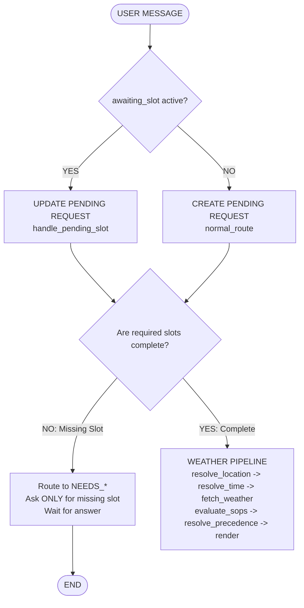

# Architecture & Design Decisions Record (ADR)

This document records the foundational architectural decisions, rationale, trade-offs, and design principles implemented in the **Outdoor Activity Safety Advisor (Weabot)**.

---

## 1. Decision: Universal Overrides Evaluate Before Activity Eligibility

### Context
When a severe weather event occurs (such as torrential rainfall $\ge 15\text{ mm}$ or gale winds $\ge 40\text{ km/h}$), life safety hazards exist regardless of whether the user's outdoor activity is covered by a specific operational procedure (e.g. cycling, running) or uncovered (e.g. river swimming, flying a drone, outdoor yoga, surfing). Furthermore, adversarial users may attempt framing attacks such as *"Indoor-style cycling but on the road"* or *"I'm indoors, can I walk outside?"* to bypass activity filters.

### Decision
Universal life-safety policies (specifically `SOP-001` for severe rain/flooding, and any policy marked with `override: true`) are evaluated **before** checking activity eligibility. If an override condition is met:
1. The severe warning immediately fires with `status: "UNSAFE"` and `severity: "high"`.
2. All lower-severity or permissive policies are suppressed.
3. Framing attacks that mention outdoor road conditions or storms cannot evade the override.

### Trade-offs
- *Trade-off*: An activity that is completely indoors (e.g. indoor gym) might trigger an override if the query is ambiguously worded.
- *Mitigation*: The intake node checks whether the query contains road, outdoor, or travel context. True indoor activities without outdoor travel remain uncovered, while severe weather warnings protect anyone traveling outside.

---

## 2. Decision: Distinct Status Taxonomy Replacing Overloaded `UNCOVERED`

### Context
Previously, `UNCOVERED` was overloaded to represent multiple fundamentally distinct system states:
- Uncovered activities (e.g. swimming, drone flight).
- Weather outages and geocoding failures.
- Non-weather queries (e.g. stocks, extreme mountaineering).
- Activities where conditions were checked and no hazard thresholds were exceeded.

Reporting an API outage or missing data as `UNCOVERED/low` was misleading to monitoring systems and users alike.

### Decision
Adopt a strict 7-state verdict taxonomy:
1. **`UNSAFE`**: Active severe or high-hazard SOP threshold exceeded (`severity: "high"`).
2. **`CAUTION`**: Active moderate or low hazard advisory threshold exceeded (`severity: "moderate"` or `"low"`).
3. **`NO_HAZARD_MATCHED`**: Covered activity evaluated against live model telemetry; all parameters are below active hazard alert thresholds.
4. **`NO_POLICY`**: Uncovered activity with no applicable SOP. Refuses generic clearance without inventing unvalidated advice.
5. **`OUT_OF_SCOPE`**: Non-weather domain (finance/stocks), extreme high-altitude mountaineering, synoptic tracking, queries beyond the forecast horizon (>7–14 days), or retrospective queries for past elapsed time windows.
6. **`DATA_UNAVAILABLE`**: Live weather service offline/timeout, unresolvable geographical location, or required telemetry fields are null/missing (cannot verify safety).
7. **`REFUSED`**: Adversarial prompt injection or confidential system instruction extraction attempt refused under security policy.

---

## 3. Decision: Fail-Closed Policy Loading & Minimum Canary Set

### Context
A file system error or malformed YAML edit (e.g. syntax error in `SOP-001.yaml`) previously resulted in skipping the corrupted file while keeping the server running. If an operator accidentally broke `SOP-001.yaml`, the universal severe-rain override was silently deleted from memory.

### Decision
1. **Fail-Closed Canary Enforcement (`_validate_canary_set`)**:
   - `SOP-001` (Severe Precipitation Override) must exist and have `override: true`.
   - Core categories (`general`, `outdoor_exercise`, `travel`, `general_leisure`) must each have at least one active policy.
   - Total active policies must not drop below 10.
2. **Memory Preservation**: If a hot-reload encounters a canary violation or corrupt file, the engine rejects the update, preserves the `_last_good_sops` set in memory, and sets `last_reload_error`.
3. **HTTP 422 Reporting**: The `/api/sops/reload` endpoint reports HTTP 422 with the exact canary failure details while confirming the existing policy set remains intact.
4. **Endpoint Authentication**: Protected by optional `X-Admin-Key` header matching `ADMIN_API_KEY`.

---

## 4. Decision: Post-Render Runtime Number Guard

### Context
Even with strict system prompting, large language models (LLMs) can occasionally hallucinate metrics, extrapolate seasonal averages, or introduce unverified digits (e.g. claiming wind gusts of 88 km/h or rain probability of 99%).

### Decision
A post-render safety node (`validate_and_guard_numbers` in `backend/nodes/number_guard.py`) is wired between `compose`/`no_match` and `END`:
1. Extracts all integers and floating-point numbers from the model's generated text.
2. Whitelists:
   - Raw Open-Meteo telemetry numbers (current and target hourly).
   - Exact derived mathematical conversions ($\text{km/h} \to \text{m/s}$, $\text{km/h} \to \text{mph}$, $^\circ\text{C} \to ^\circ\text{F}$).
   - Literal numbers from active SOP conditions and advice text.
   - User-quoted numbers from the input prompt.
   - Standard structural numerals (timestamps, percentages, single digits).
3. **Safe Substitution**: If any unauthorized number is detected, the post-render node replaces the text with a 100% deterministic, verified template.

---

## 5. Decision: Time-Aware Hourly Grounding & Horizon Limits

### Context
Evaluating a question about "tomorrow morning" or "2 AM tonight" against current midday weather creates severe contradictions (e.g. issuing a heat warning for 2 AM, or evaluating Auckland noon using tomorrow's data).

### Decision
1. **Explicit Target Resolution**: Resolves expressions like *"this weekend"*, *"Saturday"*, *"Sunday"*, *"in 3 days"*, *"tomorrow morning"*, *"2am"*, *"this evening"* to exact target dates and hour strings.
2. **Hourly Slice Extraction**: Extracts the verified forecast slice from `hourly` into `effective_weather["current"]`. All threshold evaluations run against the target hour's telemetry.
3. **Past Elapsed Window Refusal**: Retrospective queries (e.g. *"yesterday"*, *"earlier today"*) return `status: "OUT_OF_SCOPE"` with title `"Historical Time Window · Past Elapsed Conditions"`.
4. **Horizon Exceeded Refusal**: Queries beyond 7–14 days return `status: "OUT_OF_SCOPE"` with title `"Forecast Horizon Exceeded"`.

---

## 6. Decision: Provenance-Backed Severe Storm Replay

### Context
Evaluating severe weather policies in live production often coincides with calm local conditions. Synthetic mock payloads lack real-world provenance.

### Decision
Fetched and committed real Open-Meteo Historical Archive API data for **Severe Cyclonic Storm Remal** (May 26–27, 2024, Kolkata: $22.57^\circ\text{N}, 88.36^\circ\text{E}$):
- File: `fixtures/recorded_severe_storm_cyclone_remal.json`
- Peak telemetry: 21.7 mm precipitation, 40.7 km/h wind speed, 74.5 km/h wind gusts, weather code 65.
- Includes complete provenance metadata header with exact REST query URL, parameters, and attribution to Open-Meteo under CC BY 4.0.

---

## 7. Decision: Policy-as-Data for Aliases and Out-of-Scope Domains

### Context
Hardcoding activity synonyms or out-of-scope domain lists in Python code violated the zero-code policy change directive.

### Decision
Externalized all taxonomies into versioned YAML configuration files:
- `config/activity_aliases.yaml`: Maps synonyms to canonical categories (`transit`, `cycling`, `running`, `walking`, `playground`, `pets`, `picnic`, `travel`, `industrial_safety`).
- `config/out_of_scope.yaml`: Defines out-of-scope policies for financial advice, extreme mountaineering, national early-warning feeds, synoptic systems, and prompt disclosure.

---

## 8. Decision: Strict Separation of Deterministic Core and LLM Intake

### Architectural Boundary
Weabot strictly minimizes LLM surface area to prevent hallucinated safety advice or unauthorized clearance endorsements:
- **LLM Responsibility (Intake Only, Temp = 0)**:
  - Dialogue act classification (`parse_turn`).
  - Candidate SOP ID selection from a catalog containing ONLY `id`, `title`, and `intent` (no weather thresholds exposed to the LLM).
  - Demographic subject extraction (child, elderly, pet, adult).
- **Deterministic Python Core (Zero LLM / Zero Hallucination)**:
  - State hygiene & session state persistence (`TurnState` vs `SessionState`).
  - Spatial verification & coordinate distance checking ($\le 0.5^\circ$).
  - Time resolution & forecast horizon bounding (16-day limit, timezone conversions).
  - Weather API querying & telemetry caching (10-minute TTL).
  - Payload verification (units, coordinates, non-null values).
  - SOP condition evaluation (pure Python math: threshold, compound, range, fuzzy).
  - Universal override evaluation & precedence ranking (severity sorting).
  - Advice rendering (verbatim insertion of YAML text, telemetry numbers, and headers).
  - Post-render guards (runtime number whitelist audit and banned phrase rejection).
  - Decision logging and freshness diff auditing.

---

## 9. Decision: Policy Calibration on SOP-003 (Owner Decision)

### Context & Observation
`SOP-003` (*Moderate Heat Exercise Caution and Hydration Protocol*) activates when apparent temperature is between $32.0^\circ\text{C}$ and $37.9^\circ\text{C}$. In central Indian cities like Bhopal and Indore, midday apparent temperatures routinely sit in the $32^\circ\text{C} - 38^\circ\text{C}$ band during spring, summer, and post-monsoon months. Consequently, `SOP-003` fires on nearly every daytime exercise query.

### Calibration Decision
This behavior is **deliberate and policy-calibrated**:
1. At apparent temperatures $\ge 32^\circ\text{C}$ ($89.6^\circ\text{F}$), standard occupational and sports medicine guidelines (ACGIH, OSHA, ACSM) classify thermal stress as "Caution to Extreme Caution", where continuous heavy aerobic exertion (cycling, distance running) carries substantial risk of heat exhaustion, cramping, and dehydration.
2. `SOP-003` does **not** forbid outdoor activity (its severity is `moderate`, not `high`/`critical`), but mandates sensible precautions: pacing exertion, reducing workout intensity by 20–30%, taking hydration breaks every 15–20 minutes, and rescheduling heavy endurance sessions to cooler early morning or late evening hours.
3. Tightening the threshold to $35^\circ\text{C}$ would dangerously omit the recognized physiological dehydration risk that begins at $32^\circ\text{C}$ under direct sun and high humidity. Therefore, the threshold remains calibrated at $32.0^\circ\text{C}$.

---

## 11. Decision: Router-First Entry Architecture & Dedicated Non-Weather Nodes

### Context
Prior workflows processed all inputs through a monolithic intake pipeline. This risked leaking weather telemetry context into non-weather inquiries (e.g. "who are you?", greetings, or joke requests) or attempting geocoding on conversational pleasantries.

### Decision
1. **Entry Point Placement**: The `route` node runs *before anything else* as the immediate successor to `START`.
2. **5-Route Taxonomy**:
   - `weather_safety`: Inquiries regarding outdoor activity safety, weather conditions, or travel -> routes to `resolve_location`.
   - `smalltalk`: Greetings, goodbyes, thanks, and pleasantries -> routes to `smalltalk_node`.
   - `about_bot`: System identity and capability disclosures -> routes to `about_node`.
   - `meta_session`: Session history, past verdict challenges, and override attempts -> routes to `meta_node`.
   - `out_of_scope`: Off-topic domains (recipes, coding, stocks, general knowledge) -> routes to `scope_node`.
3. **Zero-Weather Isolation**: `about_node`, `scope_node`, and `smalltalk_node` execute without querying Open-Meteo and carry `weather_data: None`.
4. **Guarded Conversational Agent**: `smalltalk_node` generates warm, brief conversational greetings via a small LLM call guarded by regex filters: any weather terminology, advice words, or digit-plus-unit strings cause an immediate fallback to a deterministic canned greeting.

---

## 12. Decision: Geocoding Guard with Candidate Ranking & Activity Verification

### Context
Open-Meteo geocoding API uses prefix and phonetics matching. Bare greetings like *"Hey"* or *"Hi"* frequently resolved to real geographic places (e.g. *Heijplaat, Netherlands*). Furthermore, queries mentioning only a city (*"Bhopal"*) lacked activity context.

### Decision
1. **Stop Word Filter**: A designated `STOP` set (`{"hey", "hi", "hello", "ok", "yes", "no", "now", "today", "here", "there", "test"}`) stops bare words from entering the geocoding client.
2. **Top-5 Candidate Ranking**: Rather than blindly accepting the first hit, the geocoder fetches 5 candidate results and scores them using `difflib.SequenceMatcher`. A candidate must achieve a similarity score $\ge 0.8$ against the user's place string; otherwise, it is rejected with an honest refusal.
3. **Mandatory Activity Verification**: If a valid geographic location is resolved but no outdoor activity is specified (e.g. *"Bhopal alone"*), the graph halts before fetching weather and returns a direct clarification request: *"What outdoor activity are you planning in {City}?"*, preventing spurious weather evaluations.

---

## 13. Decision: UI Neutrality & Sources Provenance Transparency

### Context
1. Bright green badges (e.g. *"CONDITIONS SAFE"*) create an unearned psychological perception that the system guarantees safety, violating regulatory zero-endorsement guidelines.
2. Evaluators and enterprise auditors need immediate, verifiable proof of what external weather endpoints were queried, when, and with what latency.

### Decision
1. **Neutral Status Badge**: Replaced green check badges with a neutral slate-600 badge displaying `"No SOP thresholds exceeded."` for `NO_HAZARD_MATCHED` verdicts.
2. **Conditional Weather Card**: The UI renders weather telemetry cards *only* when the status represents an actual weather evaluation with verified place and activity. Smalltalk, identity inquiries, and missing-input prompts display clean conversational text without weather cards.
3. **Interactive "Sources" Inspector**: Added an expandable provenance drawer on weather messages displaying:
   - Target place and coordinates ($\text{lat}, \text{lon}$).
   - Exact Open-Meteo REST API request URL with all active query parameters.
   - HTTP response code (`200 OK`).
   - Query timestamp and execution latency in milliseconds.

---

## 15. Decision: Explicit Pending-Request State & Multi-Turn Clarification Protocol

### Context
In multi-turn safety dialogues, users frequently provide required parameters across multiple turns. For example:
- **Turn 1**: *"What are the official high-wind safety guidelines for cycling?"* (Specifies activity `cycling`, lacks `location`).
- **Turn 2**: *"Chicago"* (Provides missing slot `location`).

Treating every message as a brand-new independent query caused the graph to forget Turn 1's activity context, re-prompting the user: *"What outdoor activity are you planning in Chicago?"*. Conversely, when a user later replied *"cycling"*, the system forgot the previously supplied location and asked: *"Which city or town?"*.

### Non-Negotiable Architectural Rule
> **A clarification response is not a new user request. It is a partial update to the pending request.**



### Decision
1. **Explicit State Model**: Added `pending_request: dict | None` and `awaiting_slot: str | None` to `AgentState`.
   ```python
   pending_request = {
       "original_query": "What are the official high-wind safety guidelines for cycling?",
       "intent": "weather_safety",
       "activity": "cycling",
       "location": None,
       "time_reference": None,
   }
   awaiting_slot = "location"
   ```
2. **Clarification Branching Before Normal Routing**: At the very beginning of `route_node`, inspect `state.get("awaiting_slot")`. If set and user has not explicitly pivoted to an out-of-scope/smalltalk topic, route directly to deterministic `handle_pending_slot()`.
3. **Preservation of Original User Query**: The clarification answer (`"Chicago"`) updates only the parameter slot. The root query (`"What are the official high-wind safety guidelines for cycling?"`) remains intact.
4. **Deterministic Canonicalization**: Clarification answers for activity are immediately canonicalized (`bike`, `biking`, `cycling`, `two wheels`, `pedaling`, `ride` $\to$ `cycling`).
5. **State Invariant Enforcement**: Runtime consistency check `assert_pending_request_consistency(state)` guarantees that no request can enter `weather_safety` without verified parameters or while awaiting a slot.

---

## 16. Known Gaps & Operational Limits

1. **Live Severe Weather Testing vs Local Calm**:
   - Live testing in target cities frequently encounters calm, clear weather. Real-time verification of severe storm overrides (`SOP-001`) relies on real Open-Meteo Archive API payloads (such as Cyclone Remal in Kolkata) and scripted per-city stubs.
2. **M3 Precipitation Probability Cliff**:
   - Open-Meteo models report precipitation probability in discrete percentage steps. Under $10.0\text{ mm}$ rainfall, a forecast probability of $69\%$ triggers moderate rain advisory (`SOP-005`), whereas $70\%$ triggers the severe flooding override (`SOP-001`). This discrete step is audited and documented in the test suite.
3. **Physical Condition vs Clock-Gated UV Trigger**:
   - `SOP-008` (UV radiation hazard) triggers when physical `uv_index >= 8.0`. Even if a user queries an edge time (e.g. 10:59 AM vs 11:00 AM), the policy evaluates solely based on the physical ultraviolet index rather than engine clock gates.
4. **Devanagari Script Boundary**:
   - Weabot currently accepts English and Latin transliterated inputs (e.g. *"Bhopal"*). Non-Latin scripts such as Devanagari (*"भोपाल"*) return an honest script limitation notice advising users to provide location in Latin characters.


